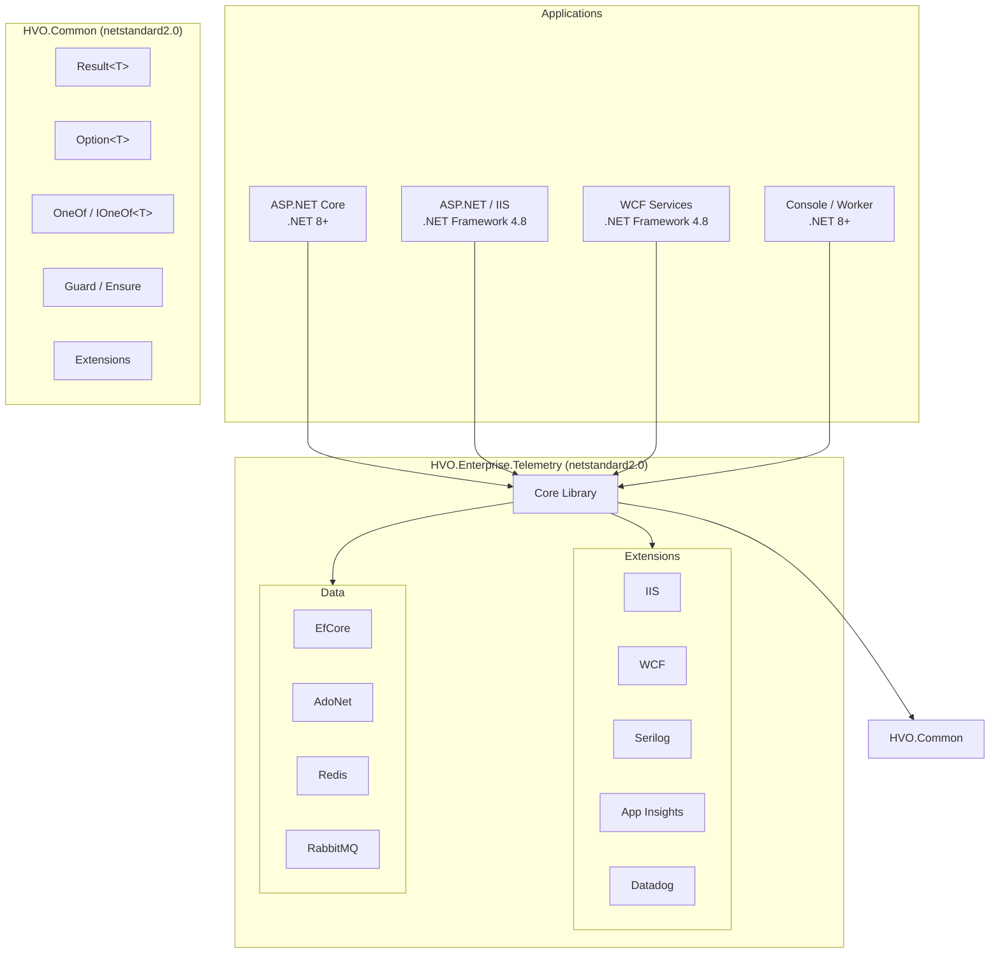
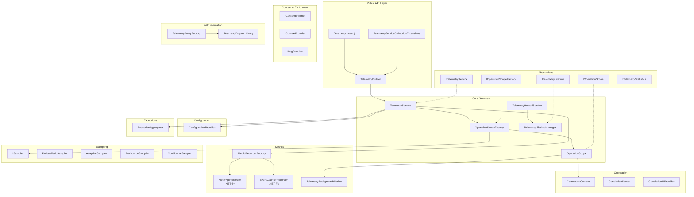
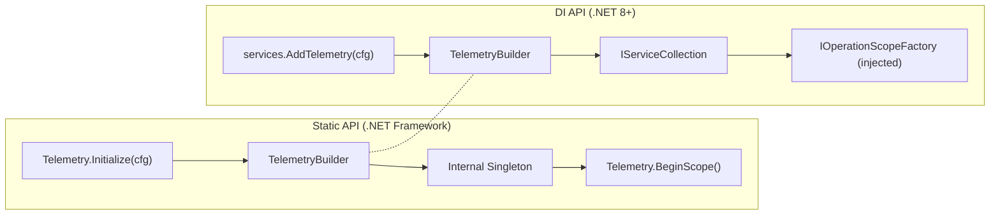
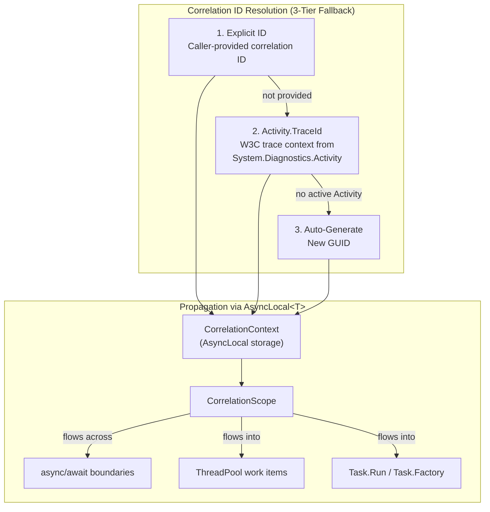
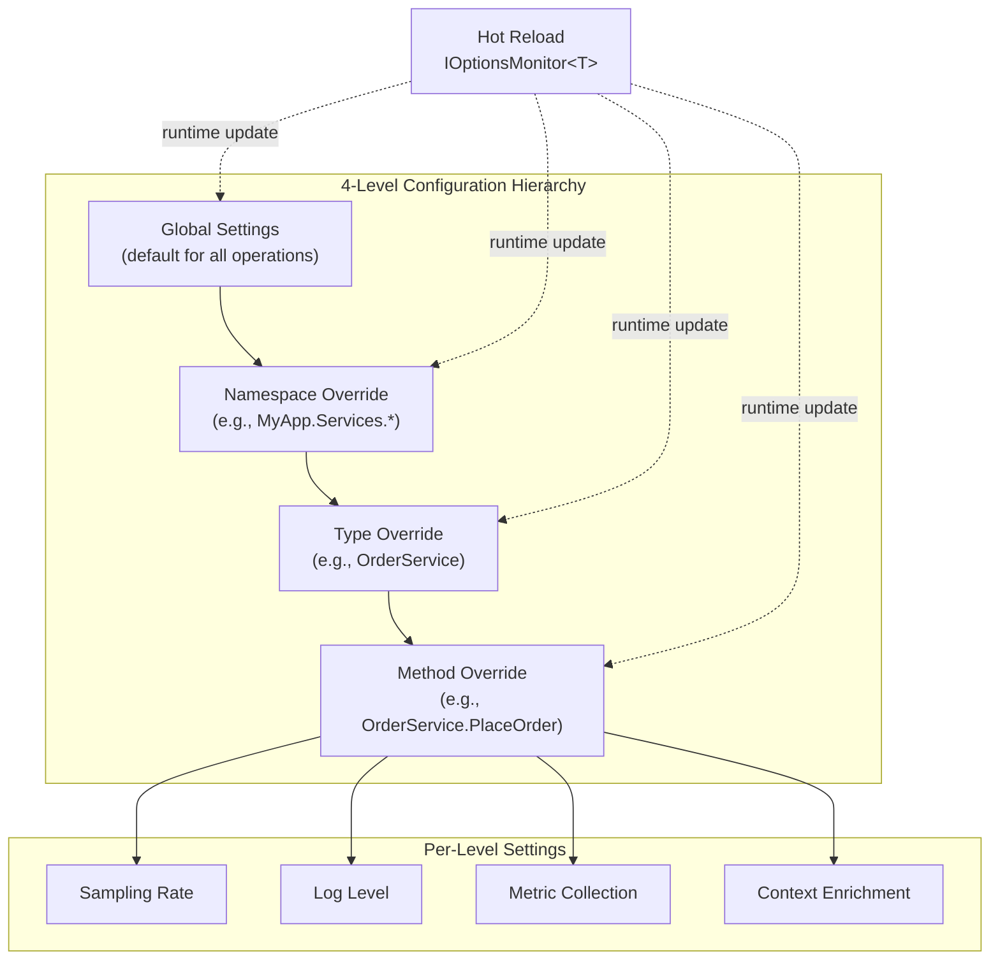
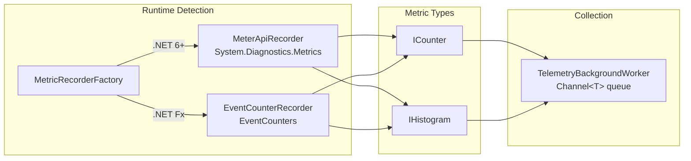
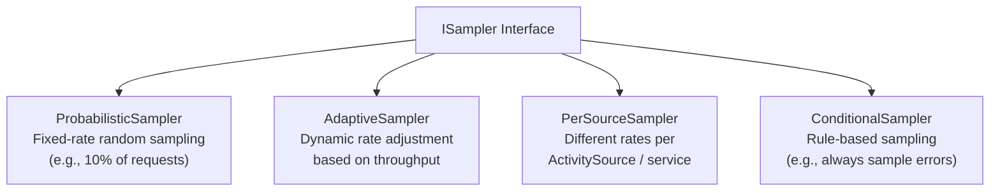
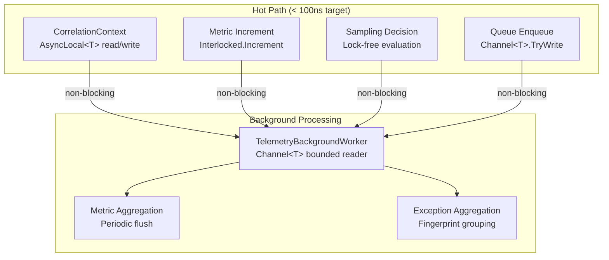
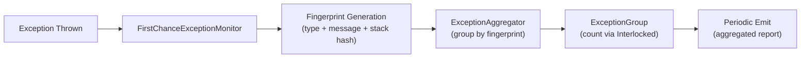
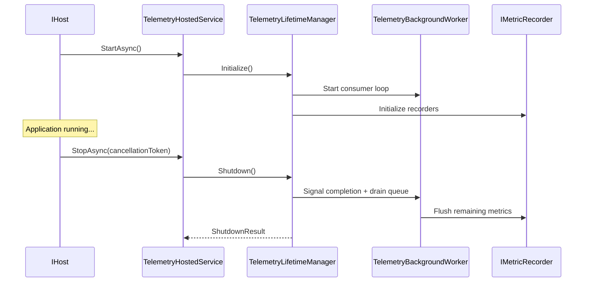

# HVO.Enterprise Architecture

## Overview

HVO.Enterprise is a modular .NET telemetry and logging library providing unified observability across all .NET platforms — from .NET Framework 4.8 through .NET 10+. It targets .NET Standard 2.0 for single-binary deployment while using runtime-adaptive features on modern platforms.



## Package Structure

| Package | Target | Purpose |
|---------|--------|---------|
| [`HVO.Common`](../src/HVO.Common/) | netstandard2.0 | Shared utilities: `Result<T>`, `Option<T>`, `OneOf`, guards, extensions |
| [`HVO.Enterprise.Telemetry`](../src/HVO.Enterprise.Telemetry/) | netstandard2.0 | Core telemetry: tracing, metrics, logging, configuration |
| [`HVO.Enterprise.Telemetry.IIS`](../src/HVO.Enterprise.Telemetry.IIS/) | netstandard2.0 | IIS lifecycle & request telemetry |
| [`HVO.Enterprise.Telemetry.Wcf`](../src/HVO.Enterprise.Telemetry.Wcf/) | netstandard2.0 | WCF dispatch inspector integration |
| [`HVO.Enterprise.Telemetry.Serilog`](../src/HVO.Enterprise.Telemetry.Serilog/) | netstandard2.0 | Serilog enricher bridge |
| [`HVO.Enterprise.Telemetry.AppInsights`](../src/HVO.Enterprise.Telemetry.AppInsights/) | netstandard2.0 | Application Insights telemetry export |
| [`HVO.Enterprise.Telemetry.Datadog`](../src/HVO.Enterprise.Telemetry.Datadog/) | netstandard2.0 | Datadog APM integration |
| [`HVO.Enterprise.Telemetry.Data`](../src/HVO.Enterprise.Telemetry.Data/) | netstandard2.0 | Shared data instrumentation base |
| [`HVO.Enterprise.Telemetry.Data.EfCore`](../src/HVO.Enterprise.Telemetry.Data.EfCore/) | netstandard2.0 | Entity Framework Core diagnostics |
| [`HVO.Enterprise.Telemetry.Data.AdoNet`](../src/HVO.Enterprise.Telemetry.Data.AdoNet/) | netstandard2.0 | ADO.NET command tracing |
| [`HVO.Enterprise.Telemetry.Data.Redis`](../src/HVO.Enterprise.Telemetry.Data.Redis/) | netstandard2.0 | Redis operation tracing |
| [`HVO.Enterprise.Telemetry.Data.RabbitMQ`](../src/HVO.Enterprise.Telemetry.Data.RabbitMQ/) | netstandard2.0 | RabbitMQ message tracing |

## Core Component Architecture



## Dual API Design

The library supports both static and dependency injection entry points to serve legacy .NET Framework and modern .NET 8+ applications.



**Static API** — [`Telemetry.cs`](../src/HVO.Enterprise.Telemetry/Telemetry.cs)

Used in .NET Framework applications without a DI container. Initializes an internal singleton and exposes static methods for creating operation scopes.

**DI API** — [`TelemetryServiceCollectionExtensions.cs`](../src/HVO.Enterprise.Telemetry/TelemetryServiceCollectionExtensions.cs)

Registers all telemetry services in the `IServiceCollection`. Consumers inject `IOperationScopeFactory` or `ITelemetryService`.

**Builder** — [`TelemetryBuilder.cs`](../src/HVO.Enterprise.Telemetry/TelemetryBuilder.cs)

Fluent configuration shared by both paths. Configures sampling, metrics backend, enrichers, and extension packages.

## Request Flow

```mermaid
sequenceDiagram
    participant App as Application Code
    participant SF as OperationScopeFactory
    participant CC as CorrelationContext
    participant OS as OperationScope
    participant Act as System.Diagnostics.Activity
    participant Samp as ISampler
    participant BG as TelemetryBackgroundWorker
    participant MR as IMetricRecorder

    App->>SF: CreateScope("OrderService.PlaceOrder")
    SF->>Samp: ShouldSample(context)
    Samp-->>SF: SamplingDecision

    SF->>CC: GetOrCreateCorrelationId()
    Note over CC: 3-tier fallback:<br/>1. Explicit ID<br/>2. Activity.TraceId<br/>3. Auto-generate GUID

    CC-->>SF: correlationId

    SF->>Act: new Activity("OrderService.PlaceOrder")
    SF->>OS: new OperationScope(activity, correlationId)
    OS-->>App: IOperationScope

    App->>App: Execute business logic

    App->>OS: Dispose()
    OS->>OS: Calculate duration, capture result
    OS->>BG: Enqueue(telemetryEvent)
    Note over BG: Channel&lt;T&gt; bounded queue<br/>non-blocking enqueue

    BG->>MR: Record(metrics)
    BG->>MR: Flush()
```

## Correlation Propagation



**Key files:**
- [`CorrelationContext.cs`](../src/HVO.Enterprise.Telemetry/Correlation/CorrelationContext.cs) — `AsyncLocal<T>` storage for the current correlation ID
- [`CorrelationScope.cs`](../src/HVO.Enterprise.Telemetry/Correlation/CorrelationScope.cs) — Disposable scope that sets/restores correlation context
- [`CorrelationIdProvider.cs`](../src/HVO.Enterprise.Telemetry/Correlation/CorrelationIdProvider.cs) — Implements the 3-tier fallback resolution

## Configuration Hierarchy



**Key file:** [`ConfigurationProvider.cs`](../src/HVO.Enterprise.Telemetry/Configuration/ConfigurationProvider.cs)

More specific levels override less specific ones. Method-level settings take highest priority. Configuration supports hot reload via `IOptionsMonitor<T>` — changes take effect without application restart.

## Metrics Pipeline



**Key files:**
- [`IMetricRecorder.cs`](../src/HVO.Enterprise.Telemetry/Metrics/IMetricRecorder.cs) — Abstraction over metric backends
- [`MeterApiRecorder.cs`](../src/HVO.Enterprise.Telemetry/Metrics/MeterApiRecorder.cs) — Modern .NET 6+ `System.Diagnostics.Metrics` implementation
- [`EventCounterRecorder.cs`](../src/HVO.Enterprise.Telemetry/Metrics/EventCounterRecorder.cs) — .NET Framework `EventCounter` fallback
- [`MetricRecorderFactory.cs`](../src/HVO.Enterprise.Telemetry/Metrics/MetricRecorderFactory.cs) — Runtime detection and recorder selection

## Sampling Strategies



**Key file:** [`ISampler.cs`](../src/HVO.Enterprise.Telemetry/Sampling/ISampler.cs)

Samplers are registered via `TelemetryBuilder` and consulted by `OperationScopeFactory` before creating each operation scope. The `AdaptiveSampler` uses `Interlocked` operations for lock-free throughput tracking.

## Threading & Concurrency Model



### Design Principles

| Concern | Approach | Implementation |
|---------|----------|----------------|
| Correlation propagation | `AsyncLocal<T>` | Flows automatically across `async/await`, `Task.Run`, `ThreadPool.QueueUserWorkItem` |
| Metric recording | `Interlocked` operations | Atomic counter increments, no locks on hot paths |
| Telemetry dispatch | `Channel<T>` bounded queue | Non-blocking `TryWrite` on producer side; dedicated consumer loop |
| Queue backpressure | Bounded capacity + drop policy | Oldest items dropped when queue is full — never blocks the caller |
| Lifecycle management | `IHostedService` | Graceful drain on shutdown via [`TelemetryHostedService`](../src/HVO.Enterprise.Telemetry/TelemetryHostedService.cs) and [`TelemetryLifetimeManager`](../src/HVO.Enterprise.Telemetry/Lifecycle/TelemetryLifetimeManager.cs) |

### Key files:
- [`TelemetryBackgroundWorker.cs`](../src/HVO.Enterprise.Telemetry/Metrics/TelemetryBackgroundWorker.cs) — `Channel<T>` consumer loop
- [`ExceptionAggregator.cs`](../src/HVO.Enterprise.Telemetry/Exceptions/ExceptionAggregator.cs) — Fingerprint-based grouping with `Interlocked` counters
- [`TelemetryStatistics.cs`](../src/HVO.Enterprise.Telemetry/HealthChecks/TelemetryStatistics.cs) — Atomic counters for queue depth, processed events

## Extension Points

### IContextEnricher

Add custom key-value pairs to every telemetry event.

```csharp
public class UserContextEnricher : IContextEnricher
{
    public void Enrich(IDictionary<string, object> context)
    {
        context["user.id"] = GetCurrentUserId();
        context["tenant.id"] = GetCurrentTenantId();
    }
}
```

**Interface:** [`IContextEnricher.cs`](../src/HVO.Enterprise.Telemetry/Context/IContextEnricher.cs)

### ISampler

Custom sampling logic to control which operations are traced.

```csharp
public class ErrorAlwaysSampler : ISampler
{
    public SamplingDecision ShouldSample(SamplingContext context)
    {
        if (context.HasError)
            return SamplingDecision.RecordAndSample;
        return SamplingDecision.Drop;
    }
}
```

**Interface:** [`ISampler.cs`](../src/HVO.Enterprise.Telemetry/Sampling/ISampler.cs)

### IMetricRecorder

Plug in custom metric backends beyond the built-in `MeterApiRecorder` and `EventCounterRecorder`.

**Interface:** [`IMetricRecorder.cs`](../src/HVO.Enterprise.Telemetry/Metrics/IMetricRecorder.cs)

### DispatchProxy Instrumentation

Automatic method-level telemetry via `System.Reflection.DispatchProxy`. Decorate interfaces to get tracing without modifying implementation code.

**Key files:**
- [`TelemetryDispatchProxy.cs`](../src/HVO.Enterprise.Telemetry/Proxies/TelemetryDispatchProxy.cs) — Proxy implementation
- [`TelemetryProxyFactory.cs`](../src/HVO.Enterprise.Telemetry/Proxies/TelemetryProxyFactory.cs) — Factory for creating instrumented proxies
- [`InstrumentClassAttribute.cs`](../src/HVO.Enterprise.Telemetry/Proxies/InstrumentClassAttribute.cs) / [`InstrumentMethodAttribute.cs`](../src/HVO.Enterprise.Telemetry/Proxies/InstrumentMethodAttribute.cs) — Attribute-driven instrumentation

### Platform Extension Registration

Each extension package registers its services via `IServiceCollection`:

```csharp
services.AddTelemetry(builder =>
{
    builder.AddAppInsights(options => { ... });
    builder.AddDatadog(options => { ... });
    builder.AddSerilog(options => { ... });
});
```

## Exception Handling



**Key file:** [`ExceptionAggregator.cs`](../src/HVO.Enterprise.Telemetry/Exceptions/ExceptionAggregator.cs)

Exceptions are grouped by fingerprint (type + message pattern + stack trace hash) to avoid flooding telemetry backends with duplicate exceptions. Counts are tracked via `Interlocked` for thread safety.

## Lifecycle Management



**Key files:**
- [`TelemetryHostedService.cs`](../src/HVO.Enterprise.Telemetry/TelemetryHostedService.cs) — `IHostedService` implementation
- [`TelemetryLifetimeManager.cs`](../src/HVO.Enterprise.Telemetry/Lifecycle/TelemetryLifetimeManager.cs) — Orchestrates startup/shutdown sequence

## Dependencies

| Dependency | Version | Purpose |
|-----------|---------|---------|
| OpenTelemetry.Api | 1.9.0 | W3C TraceContext, Baggage API |
| System.Diagnostics.DiagnosticSource | 8.0.1 | `Activity`, `ActivitySource`, `DiagnosticListener` |
| Microsoft.Extensions.DependencyInjection.Abstractions | 8.0.0 | `IServiceCollection` registration |
| Microsoft.Extensions.Logging.Abstractions | 8.0.0 | `ILogger<T>` integration |
| Microsoft.Extensions.Configuration.Abstractions | 8.0.0 | `IConfiguration` binding |
| Microsoft.Extensions.Options | 8.0.0 | `IOptions<T>`, `IOptionsMonitor<T>` |
| System.Threading.Channels | 7.0.0 | `Channel<T>` for async queue |

## HVO.Common Utilities

General-purpose functional patterns shared across all HVO projects:

| Type | File | Purpose |
|------|------|---------|
| `Result<T>` | [`Result.cs`](../src/HVO.Common/Results/Result.cs) | Railway-oriented error handling — success or failure without exceptions |
| `Option<T>` | [`Option.cs`](../src/HVO.Common/Options/Option.cs) | Explicit representation of optional values (replaces nullable returns) |
| `OneOf<T>` | [`OneOf.cs`](../src/HVO.Common/OneOf/OneOf.cs) | Discriminated union — type-safe variant containers |
| `Guard` | [`Guard.cs`](../src/HVO.Common/Utilities/Guard.cs) | Precondition checks with descriptive exceptions |
| `Ensure` | [`Ensure.cs`](../src/HVO.Common/Utilities/Ensure.cs) | Postcondition / invariant validation |

## Performance Design Decisions

1. **Lock-free hot paths** — Correlation reads, metric increments, and sampling decisions use `AsyncLocal<T>` and `Interlocked` operations to avoid contention. Target: <100ns overhead per operation.

2. **Bounded async queue** — `Channel<T>` decouples telemetry collection from processing. Producers never block; backpressure drops oldest events rather than slowing the application.

3. **Runtime-adaptive metrics** — `MetricRecorderFactory` detects the runtime at startup and selects `MeterApiRecorder` (.NET 6+) or `EventCounterRecorder` (.NET Framework) to use the most efficient API available.

4. **DispatchProxy over reflection** — Method-level instrumentation uses `DispatchProxy` for compile-time-friendly interception rather than runtime IL emission, keeping startup cost low.

5. **Exception aggregation** — Fingerprint-based grouping in `ExceptionAggregator` reduces telemetry volume by orders of magnitude during failure storms while preserving representative samples.

6. **Single-binary deployment** — Targeting .NET Standard 2.0 produces one NuGet package that works across all supported runtimes, eliminating multi-targeting complexity for consumers.
