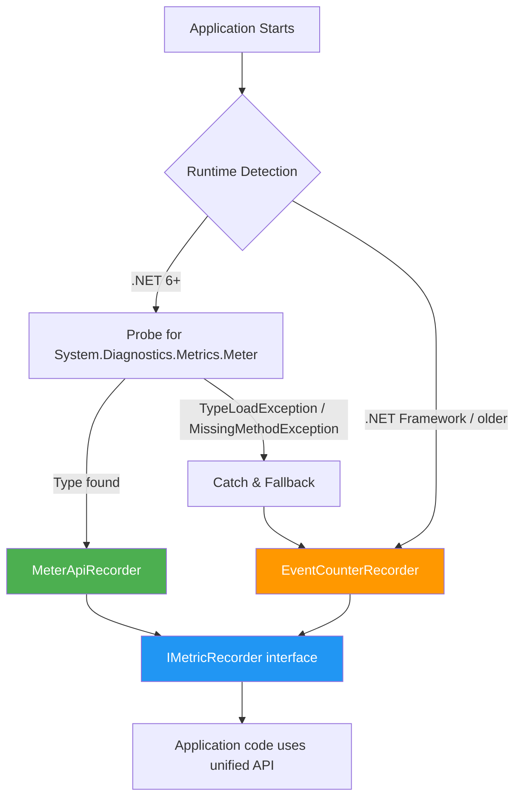

# Platform Differences

HVO.Enterprise targets .NET Standard 2.0 for single-binary deployment across all .NET platforms. Runtime-adaptive features detect platform capabilities and select optimal implementations automatically.

## Feature Comparison Matrix

| Feature | .NET Framework 4.6.1–4.8.1 | .NET Core 2.0–3.1 | .NET 6–7 | .NET 8–10+ |
|---|:---:|:---:|:---:|:---:|
| **Metrics** | EventCounter | EventCounter | Meter API | Meter API |
| **Distributed Tracing** | DiagnosticSource pkg | DiagnosticSource built-in | Activity (W3C) | Activity (W3C) |
| **Correlation** | AsyncLocal\<T\> | AsyncLocal\<T\> | AsyncLocal\<T\> | AsyncLocal\<T\> |
| **DI Integration** | Static API | IServiceCollection | IServiceCollection | Full DI + IHostedService |
| **Configuration** | Programmatic | IConfiguration | IConfiguration | IConfiguration + hot reload |
| **Span\<T\> / ref structs** | ✗ | Partial | ✔ | ✔ |
| **IIS Extension** | ✔ (primary) | N/A | N/A | N/A |
| **WCF Extension** | ✔ (primary) | Limited | Limited | Limited |
| **EF Core Extension** | ✗ | ✔ | ✔ | ✔ |
| **Serilog / AppInsights / Datadog** | ✔ | ✔ | ✔ | ✔ |
| **AdoNet / Redis / RabbitMQ** | ✔ | ✔ | ✔ | ✔ |

## Behavioral Differences

### Metrics Recording

`MetricRecorderFactory` selects the recorder implementation at startup:

| Runtime | Recorder | Detection |
|---|---|---|
| .NET 6+ | `MeterApiRecorder` (System.Diagnostics.Metrics) | `Environment.Version.Major >= 6` + reflection probe for `Meter` type |
| .NET Framework / older | `EventCounterRecorder` (EventCounter API) | Fallback when Meter type is unavailable |

Both recorders expose the same `IMetricRecorder` interface — callers never need to know which is active.

### Correlation Propagation

| Aspect | .NET Framework | .NET 6+ |
|---|---|---|
| Storage | `AsyncLocal<T>` | `AsyncLocal<T>` |
| Trace format | Custom / optional W3C | W3C TraceContext native |
| Activity integration | Via `System.Diagnostics.DiagnosticSource` NuGet | Built-in `System.Diagnostics.Activity` |
| Cross-process propagation | Manual header injection | Automatic via `ActivitySource` |

### DI vs Static API

**.NET 8+ (DI-based):**

```csharp
var builder = Host.CreateApplicationBuilder(args);
builder.Services.AddTelemetry(options =>
{
    options.ServiceName = "OrderService";
    options.EnableMetrics = true;
});
var app = builder.Build();
await app.RunAsync(); // lifecycle managed by IHostedService
```

**.NET Framework 4.8 (Static API):**

```csharp
// Application_Start or service entry point
Telemetry.Initialize(new TelemetryOptions
{
    ServiceName = "OrderService",
    EnableMetrics = true
});

// Application_End
Telemetry.Shutdown();
```

Both paths produce identical telemetry data. The static API is always available as a fallback on any platform.

### Configuration

| Capability | .NET Framework | .NET 8+ |
|---|---|---|
| 4-level hierarchy (Global → Namespace → Type → Method) | ✔ | ✔ |
| Programmatic config | ✔ | ✔ |
| `IConfiguration` binding | ✗ | ✔ |
| Hot reload | Manual | `IOptionsMonitor<T>` |
| HTTP endpoint reload | ✔ | ✔ |

## Fallback Strategy



The factory caches the result after first detection — subsequent calls return the singleton instance in ~1.9 ns with zero allocation.

## Performance Characteristics

Benchmarked on .NET 10.0.2 (RyuJIT, AdvSIMD). All core operations are zero-allocation on the hot path.

| Operation | Latency | Allocation | Target |
|---|---:|---:|---|
| Counter.Add (no tags) | 1.23 ns | 0 B | < 100 ns ✔ |
| Histogram.Record (no tags) | 0.79 ns | 0 B | < 100 ns ✔ |
| Observable Gauge callback | 18.64 ns | 72 B | < 100 ns ✔ |
| Correlation read (hot path) | 19.30 ns | 1 B | < 100 ns ✔ |
| Correlation scope create/dispose | 66.22 ns | 33 B | < 100 ns ✔ |
| OperationScope create/dispose (minimal) | 93.51 ns | 368 B | < 100 ns ✔ |
| OperationScope create/dispose (default) | 316.17 ns | 1,008 B | Acceptable |
| Factory instance access | 1.88 ns | 0 B | < 100 ns ✔ |
| Queue enqueue (fast path) | 96.86 ns | 0 B | < 100 ns ✔ |
| Queue depth read | 0.44 ns | 0 B | < 100 ns ✔ |

### Platform-Specific Performance Notes

| Factor | .NET Framework 4.8 | .NET 8–10+ |
|---|---|---|
| JIT | RyuJIT (less aggressive inlining) | RyuJIT (tiered compilation, PGO) |
| Struct handling | Higher boxing overhead | Better ref struct / Span support |
| Async overhead | Higher Task allocation | ValueTask, pooled async state machines |
| Expected overhead delta | ~1.2–1.5× above benchmarked values | Baseline (benchmarked) |

> **Note:** Benchmarks above were captured on .NET 10. Expect slightly higher latency (~20–50%) on .NET Framework due to JIT and GC differences, but all operations remain well within the <100 ns hot-path budget.

See [benchmark-report-2026-02-08.md](benchmarks/benchmark-report-2026-02-08.md) for full results.

## Best Practices by Platform

### .NET 8+ (Modern)

- Use `builder.Services.AddTelemetry()` for full DI lifecycle management.
- Bind configuration via `IConfiguration` and use `IOptionsMonitor<T>` for hot reload.
- Prefer `ValueTask` on async hot paths to reduce allocation.
- Use the `Activity` API directly when custom trace propagation is needed.

### .NET Framework 4.8 (Legacy)

- Call `Telemetry.Initialize()` early in startup (`Application_Start`, `Main`, or service `OnStart`).
- Call `Telemetry.Shutdown()` on graceful exit to flush pending telemetry.
- Install `System.Diagnostics.DiagnosticSource` NuGet for Activity support.
- Use the IIS extension for ASP.NET request telemetry and the WCF extension for service operations.
- Configure telemetry programmatically — `IConfiguration` binding is not available.

### All Platforms

- Use `OperationScope` for structured tracing — it works identically everywhere.
- Use `IMetricRecorder` for metrics — the factory selects the right implementation.
- Keep tag cardinality low to avoid metric explosion on any backend.
- Leverage the 4-level configuration hierarchy to tune verbosity per namespace or type.
