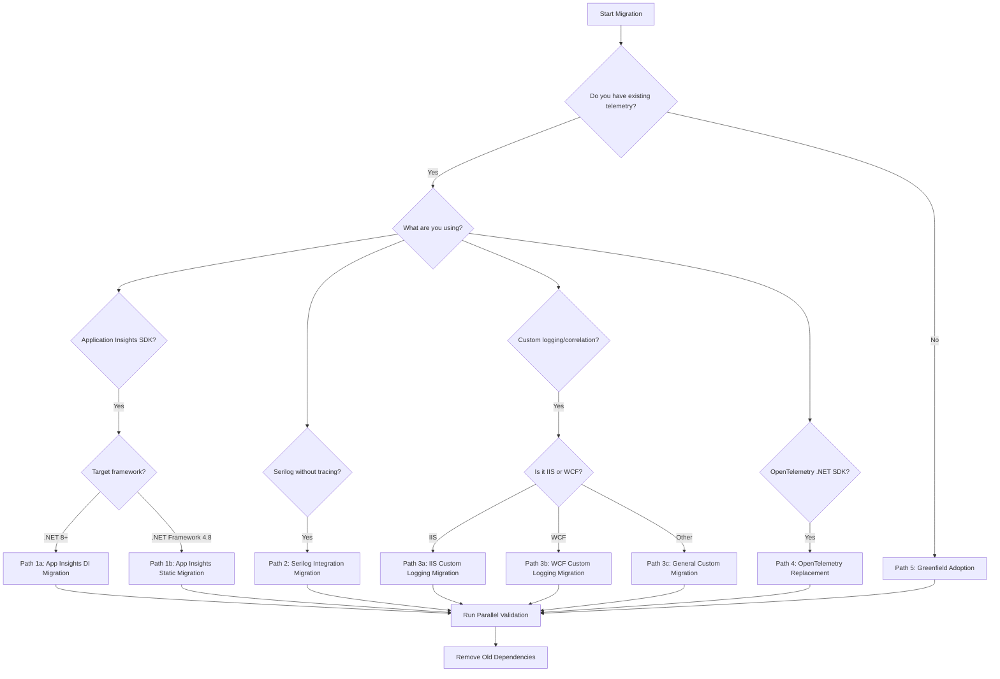
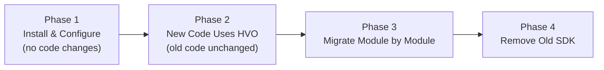

# Migration Guide — HVO.Enterprise.Telemetry

This guide covers migrating from common telemetry solutions to HVO.Enterprise.Telemetry, with step-by-step instructions, before/after code examples, and strategies for gradual adoption.

---

## Table of Contents

- [Migration Decision Flowchart](#migration-decision-flowchart)
- [Migration Path 1: From Application Insights SDK](#migration-path-1-from-application-insights-sdk)
- [Migration Path 2: From Serilog (No Unified Tracing)](#migration-path-2-from-serilog-no-unified-tracing)
- [Migration Path 3: From Custom Logging/Correlation](#migration-path-3-from-custom-loggingcorrelation)
- [Migration Path 4: From OpenTelemetry .NET SDK](#migration-path-4-from-opentelemetry-net-sdk)
- [Migration Path 5: Greenfield Adoption](#migration-path-5-greenfield-adoption)
- [Gradual Migration Strategy](#gradual-migration-strategy)
- [Testing Strategies During Migration](#testing-strategies-during-migration)
- [Common Pitfalls and Solutions](#common-pitfalls-and-solutions)

---

## Migration Decision Flowchart

Use this flowchart to determine which migration path applies to your project:



---

## Migration Path 1: From Application Insights SDK

### Step 1 — Install packages

Remove the old Application Insights packages and add HVO.Enterprise equivalents:

```xml
<!-- REMOVE these -->
<PackageReference Include="Microsoft.ApplicationInsights" Version="2.*" />
<PackageReference Include="Microsoft.ApplicationInsights.AspNetCore" Version="2.*" />

<!-- ADD these -->
<PackageReference Include="HVO.Enterprise.Telemetry" Version="1.*" />
<PackageReference Include="HVO.Enterprise.Telemetry.AppInsights" Version="1.*" />
```

### Step 2 — Replace initialization

#### .NET 8+ (DI-based)

**Before** — Application Insights SDK:

```csharp
using Microsoft.ApplicationInsights.Extensibility;

var builder = WebApplication.CreateBuilder(args);
builder.Services.AddApplicationInsightsTelemetry(options =>
{
    options.ConnectionString = "InstrumentationKey=...";
});
```

**After** — HVO.Enterprise.Telemetry:

```csharp
using HVO.Enterprise.Telemetry;
using HVO.Enterprise.Telemetry.AppInsights;

var builder = WebApplication.CreateBuilder(args);
builder.Services.AddTelemetry(options =>
{
    options.ServiceName = "MyService";
    options.ActivitySources.Add("MyApp.*");
});

builder.Services.AddAppInsightsTelemetry(ai =>
{
    ai.ConnectionString = "InstrumentationKey=...";
});
```

#### .NET Framework 4.8 (static initialization)

**Before** — Application Insights SDK:

```csharp
using Microsoft.ApplicationInsights;
using Microsoft.ApplicationInsights.Extensibility;

TelemetryConfiguration.Active.InstrumentationKey = "your-key";
var client = new TelemetryClient();
client.TrackEvent("AppStarted");
```

**After** — HVO.Enterprise.Telemetry:

```csharp
using HVO.Enterprise.Telemetry;

var options = new TelemetryOptions
{
    ServiceName = "MyLegacyService"
};
options.ActivitySources.Add("MyApp.*");

Telemetry.Initialize(options);
```

### Step 3 — Replace TelemetryClient usage

**Before** — Tracking operations with Application Insights:

```csharp
using Microsoft.ApplicationInsights;
using Microsoft.ApplicationInsights.DataContracts;

public class OrderService
{
    private readonly TelemetryClient _telemetryClient;

    public OrderService(TelemetryClient telemetryClient)
    {
        _telemetryClient = telemetryClient;
    }

    public async Task<Order> ProcessOrderAsync(int orderId)
    {
        using var operation = _telemetryClient
            .StartOperation<RequestTelemetry>("ProcessOrder");
        operation.Telemetry.Properties["OrderId"] = orderId.ToString();

        try
        {
            var order = await _repository.GetOrderAsync(orderId);
            operation.Telemetry.Success = true;
            return order;
        }
        catch (Exception ex)
        {
            _telemetryClient.TrackException(ex);
            operation.Telemetry.Success = false;
            throw;
        }
    }
}
```

**After** — HVO.Enterprise.Telemetry:

```csharp
using HVO.Enterprise.Telemetry;

public class OrderService
{
    private readonly IOperationScopeFactory _scopeFactory;

    public OrderService(IOperationScopeFactory scopeFactory)
    {
        _scopeFactory = scopeFactory;
    }

    public async Task<Order> ProcessOrderAsync(int orderId)
    {
        using var scope = _scopeFactory.Begin("ProcessOrder");
        scope.WithProperty("OrderId", orderId);

        try
        {
            var order = await _repository.GetOrderAsync(orderId);
            scope.Succeed();
            return order;
        }
        catch (Exception ex)
        {
            scope.RecordException(ex);
            scope.Fail(ex);
            throw;
        }
    }
}
```

### Step 4 — Replace custom metric tracking

**Before:**

```csharp
_telemetryClient.GetMetric("OrdersProcessed").TrackValue(1);
_telemetryClient.TrackTrace("Order completed", SeverityLevel.Information);
```

**After:**

```csharp
using var scope = _scopeFactory.Begin("OrderProcessing");
scope.WithTag("metric.orders_processed", 1);
scope.WithProperty("message", "Order completed");
```

---

## Migration Path 2: From Serilog (No Unified Tracing)

This path is for projects that use Serilog for structured logging but lack distributed tracing and correlation.

### Step 1 — Install packages

```xml
<!-- KEEP existing Serilog packages -->
<PackageReference Include="Serilog" Version="3.*" />
<PackageReference Include="Serilog.Sinks.Console" Version="5.*" />

<!-- ADD HVO packages -->
<PackageReference Include="HVO.Enterprise.Telemetry" Version="1.*" />
<PackageReference Include="HVO.Enterprise.Telemetry.Serilog" Version="1.*" />
```

### Step 2 — Integrate Serilog with HVO.Enterprise

**Before** — Serilog standalone:

```csharp
Log.Logger = new LoggerConfiguration()
    .Enrich.FromLogContext()
    .Enrich.WithProperty("Application", "MyApp")
    .WriteTo.Console()
    .WriteTo.Seq("http://localhost:5341")
    .CreateLogger();
```

**After** — Serilog enriched with HVO telemetry:

```csharp
using HVO.Enterprise.Telemetry;
using HVO.Enterprise.Telemetry.Serilog;

// Initialize HVO telemetry first
builder.Services.AddTelemetry(options =>
{
    options.ServiceName = "MyApp";
    options.ActivitySources.Add("MyApp.*");
});

// Then configure Serilog with the telemetry enricher
Log.Logger = new LoggerConfiguration()
    .Enrich.FromLogContext()
    .Enrich.WithTelemetry()  // Adds trace ID, span ID, correlation ID
    .Enrich.WithProperty("Application", "MyApp")
    .WriteTo.Console()
    .WriteTo.Seq("http://localhost:5341")
    .CreateLogger();
```

### Step 3 — Add tracing to existing log-only code

**Before** — Logging without tracing:

```csharp
public async Task<PaymentResult> ChargeAsync(Payment payment)
{
    Log.Information("Charging payment {PaymentId} for {Amount}",
        payment.Id, payment.Amount);

    try
    {
        var result = await _gateway.ChargeAsync(payment);
        Log.Information("Payment {PaymentId} succeeded", payment.Id);
        return result;
    }
    catch (Exception ex)
    {
        Log.Error(ex, "Payment {PaymentId} failed", payment.Id);
        throw;
    }
}
```

**After** — Logging with tracing (existing logs still work):

```csharp
public async Task<PaymentResult> ChargeAsync(Payment payment)
{
    using var scope = _scopeFactory.Begin("ChargePayment");
    scope.WithProperty("PaymentId", payment.Id);
    scope.WithProperty("Amount", payment.Amount);

    // Existing Serilog calls now automatically include trace/span/correlation IDs
    // via the .WithTelemetry() enricher configured above.
    Log.Information("Charging payment {PaymentId} for {Amount}",
        payment.Id, payment.Amount);

    try
    {
        var result = await _gateway.ChargeAsync(payment);
        scope.Succeed();
        Log.Information("Payment {PaymentId} succeeded", payment.Id);
        return result;
    }
    catch (Exception ex)
    {
        scope.RecordException(ex);
        scope.Fail(ex);
        Log.Error(ex, "Payment {PaymentId} failed", payment.Id);
        throw;
    }
}
```

> **Key benefit**: The `.WithTelemetry()` enricher automatically injects `TraceId`, `SpanId`, and `CorrelationId` into every Serilog log event, allowing you to correlate logs with distributed traces without changing every call site.

---

## Migration Path 3: From Custom Logging/Correlation

### Step 1 — Identify your custom correlation pattern

Most custom solutions have some form of a correlation ID passed through calls. Common patterns include:

```csharp
// Pattern A: Thread-static or AsyncLocal correlation
public static class RequestContext
{
    [ThreadStatic] private static string _correlationId;
    public static string CorrelationId
    {
        get => _correlationId;
        set => _correlationId = value;
    }
}

// Pattern B: Passed explicitly through method parameters
public async Task ProcessAsync(string correlationId, OrderRequest request) { ... }

// Pattern C: HttpContext.Items or similar ambient storage
HttpContext.Current.Items["CorrelationId"] = Guid.NewGuid().ToString();
```

### Step 2 — Replace with CorrelationContext

**Before** — Custom correlation:

```csharp
public class OrderController : ApiController
{
    public async Task<IHttpActionResult> Post(OrderRequest request)
    {
        var correlationId = Request.Headers.TryGetValues("X-Correlation-Id",
            out var values) ? values.First() : Guid.NewGuid().ToString();
        RequestContext.CorrelationId = correlationId;

        _logger.Info($"[{correlationId}] Processing order");
        var result = await _service.ProcessAsync(correlationId, request);
        _logger.Info($"[{correlationId}] Order processed");

        return Ok(result);
    }
}
```

**After** — HVO.Enterprise CorrelationContext:

```csharp
using HVO.Enterprise.Telemetry;

public class OrderController : ApiController
{
    private readonly IOperationScopeFactory _scopeFactory;

    public OrderController(IOperationScopeFactory scopeFactory)
    {
        _scopeFactory = scopeFactory;
    }

    public async Task<IHttpActionResult> Post(OrderRequest request)
    {
        // CorrelationContext automatically picks up incoming correlation headers
        // or creates a new one. No manual header parsing needed.
        using var scope = _scopeFactory.Begin("ProcessOrder");

        // Access the current correlation ID if you still need it
        var correlationId = CorrelationContext.Current;

        var result = await _service.ProcessAsync(request);
        scope.Succeed();
        return Ok(result);
    }
}
```

### Step 3a — IIS applications

**Before:**

```csharp
// Global.asax.cs
protected void Application_BeginRequest()
{
    var correlationId = Guid.NewGuid().ToString();
    HttpContext.Current.Items["CorrelationId"] = correlationId;
    _logger.Info($"Request started: {correlationId}");
}

protected void Application_EndRequest()
{
    var correlationId = HttpContext.Current.Items["CorrelationId"];
    _logger.Info($"Request ended: {correlationId}");
}
```

**After:**

```csharp
using HVO.Enterprise.Telemetry;
using HVO.Enterprise.Telemetry.IIS;

// Global.asax.cs or Startup.cs
var options = new TelemetryOptions
{
    ServiceName = "MyIISApp"
};
Telemetry.Initialize(options);
```

### Step 3b — WCF services

**Before:**

```csharp
// Custom IDispatchMessageInspector
public class CorrelationInspector : IDispatchMessageInspector
{
    public object AfterReceiveRequest(ref Message request,
        IClientChannel channel, InstanceContext instanceContext)
    {
        var correlationId = GetHeaderValue(request, "X-Correlation-Id")
            ?? Guid.NewGuid().ToString();
        OperationContext.Current.Extensions.Add(
            new CorrelationExtension(correlationId));
        return correlationId;
    }

    public void BeforeSendReply(ref Message reply, object correlationState)
    {
        // Add correlation ID to response headers
    }
}
```

**After:**

```csharp
using HVO.Enterprise.Telemetry;
using HVO.Enterprise.Telemetry.Wcf;

var options = new TelemetryOptions
{
    ServiceName = "MyWcfService"
};
Telemetry.Initialize(options);
```

### Step 4 — Migrate background job correlation

**Before** — Manually passing correlation through background jobs:

```csharp
// Enqueue with correlation
var correlationId = RequestContext.CorrelationId;
BackgroundJob.Enqueue(() => ProcessAsync(correlationId, data));

// Handler receives it as parameter
public async Task ProcessAsync(string correlationId, JobData data)
{
    RequestContext.CorrelationId = correlationId;
    _logger.Info($"[{correlationId}] Processing job");
}
```

**After** — BackgroundJobContext handles it automatically:

```csharp
using HVO.Enterprise.Telemetry;

// Capture the current correlation context when enqueuing
var jobContext = BackgroundJobContext.Capture();
BackgroundJob.Enqueue(() => ProcessAsync(jobContext, data));

// Restore in the handler
public async Task ProcessAsync(BackgroundJobContext jobContext, JobData data)
{
    jobContext.Restore(); // Restores correlation ID, trace context, etc.

    using var scope = _scopeFactory.Begin("ProcessJob");
    // CorrelationContext.Current is now set from the original request
}
```

---

## Migration Path 4: From OpenTelemetry .NET SDK

If you are already using OpenTelemetry .NET SDK directly, HVO.Enterprise.Telemetry provides a higher-level abstraction while still leveraging `System.Diagnostics.Activity` underneath.

### Step 1 — Replace OpenTelemetry configuration

**Before** — OpenTelemetry SDK directly:

```csharp
using OpenTelemetry;
using OpenTelemetry.Trace;
using OpenTelemetry.Metrics;
using OpenTelemetry.Resources;

builder.Services.AddOpenTelemetry()
    .ConfigureResource(r => r.AddService("MyService"))
    .WithTracing(tracing =>
    {
        tracing
            .AddAspNetCoreInstrumentation()
            .AddHttpClientInstrumentation()
            .AddSqlClientInstrumentation()
            .AddSource("MyApp.*")
            .AddOtlpExporter(o => o.Endpoint = new Uri("http://collector:4317"));
    })
    .WithMetrics(metrics =>
    {
        metrics
            .AddAspNetCoreInstrumentation()
            .AddHttpClientInstrumentation()
            .AddOtlpExporter();
    });
```

**After** — HVO.Enterprise.Telemetry:

```csharp
using HVO.Enterprise.Telemetry;
using HVO.Enterprise.Telemetry.AppInsights;  // or Datadog, etc.
using HVO.Enterprise.Telemetry.Database;

builder.Services.AddTelemetry(options =>
{
    options.ServiceName = "MyService";
    options.ActivitySources.Add("MyApp.*");
});

// Extension packages are registered separately via DI
builder.Services.AddAppInsightsTelemetry(ai =>
{
    ai.ConnectionString = "InstrumentationKey=...";
});
// or: builder.Services.AddDatadogTelemetry(dd => { dd.AgentHost = "localhost"; });
// or: builder.Services.AddDatadogTelemetryFromEnvironment();

// Database instrumentation
builder.Services.AddEfCoreTelemetry();
builder.Services.AddAdoNetTelemetry();
builder.Services.AddRedisTelemetry();
builder.Services.AddRabbitMqTelemetry();
```

### Step 2 — Replace ActivitySource usage

**Before** — Using ActivitySource directly:

```csharp
using System.Diagnostics;

public class OrderService
{
    private static readonly ActivitySource Source = new("MyApp.Orders");

    public async Task<Order> GetOrderAsync(int id)
    {
        using var activity = Source.StartActivity("GetOrder");
        activity?.SetTag("order.id", id);

        try
        {
            var order = await _repository.FindAsync(id);
            activity?.SetStatus(ActivityStatusCode.Ok);
            return order;
        }
        catch (Exception ex)
        {
            activity?.SetStatus(ActivityStatusCode.Error, ex.Message);
            activity?.RecordException(ex);
            throw;
        }
    }
}
```

**After** — Using IOperationScopeFactory:

```csharp
using HVO.Enterprise.Telemetry;

public class OrderService
{
    private readonly IOperationScopeFactory _scopeFactory;

    public OrderService(IOperationScopeFactory scopeFactory)
    {
        _scopeFactory = scopeFactory;
    }

    public async Task<Order> GetOrderAsync(int id)
    {
        using var scope = _scopeFactory.Begin("GetOrder");
        scope.WithProperty("order.id", id);

        try
        {
            var order = await _repository.FindAsync(id);
            scope.Succeed();
            return order;
        }
        catch (Exception ex)
        {
            scope.RecordException(ex);
            scope.Fail(ex);
            throw;
        }
    }
}
```

> **Note**: `IOperationScopeFactory.Begin()` wraps `System.Diagnostics.Activity` internally, so your existing activity listeners and exporters will continue to work during a gradual migration.

### Step 3 — Replace direct database instrumentation

**Before:**

```csharp
// EF Core with OpenTelemetry
services.AddDbContext<AppDbContext>(options =>
    options.UseSqlServer(connectionString));
// Instrumented via AddSqlClientInstrumentation() globally

// ADO.NET manual instrumentation
using var activity = Source.StartActivity("ExecuteQuery");
using var connection = new SqlConnection(connectionString);
```

**After:**

```csharp
// EF Core
services.AddDbContext<AppDbContext>(options =>
{
    options.UseSqlServer(connectionString);
    options.AddHvoTelemetry(); // Per-context instrumentation
});

// ADO.NET
using var scope = _scopeFactory.Begin("ExecuteQuery");
using var connection = new SqlConnection(connectionString).WithTelemetry();
```

---

## Migration Path 5: Greenfield Adoption

Starting from scratch is the simplest path.

### Step 1 — Install the core package

```xml
<PackageReference Include="HVO.Enterprise.Telemetry" Version="1.*" />
```

Add extension packages as needed:

```xml
<!-- Pick your backend -->
<PackageReference Include="HVO.Enterprise.Telemetry.AppInsights" Version="1.*" />
<!-- or -->
<PackageReference Include="HVO.Enterprise.Telemetry.Datadog" Version="1.*" />

<!-- Optional integrations -->
<PackageReference Include="HVO.Enterprise.Telemetry.Serilog" Version="1.*" />
<PackageReference Include="HVO.Enterprise.Telemetry.Database" Version="1.*" />
```

### Step 2 — Configure telemetry

#### .NET 8+ with dependency injection

```csharp
using HVO.Enterprise.Telemetry;
using HVO.Enterprise.Telemetry.AppInsights;
using HVO.Enterprise.Telemetry.Serilog;
using HVO.Enterprise.Telemetry.Database;

var builder = WebApplication.CreateBuilder(args);

builder.Services.AddTelemetry(options =>
{
    options.ServiceName = "MyNewService";
    options.ActivitySources.Add("MyNewService.*");
});

// Backend
builder.Services.AddAppInsightsTelemetry(ai =>
{
    ai.ConnectionString = builder.Configuration["ApplicationInsights:ConnectionString"];
});

// Database
builder.Services.AddEfCoreTelemetry();
builder.Services.AddRedisTelemetry();

var app = builder.Build();
```

#### .NET Framework 4.8

```csharp
using HVO.Enterprise.Telemetry;
using HVO.Enterprise.Telemetry.AppInsights;
using HVO.Enterprise.Telemetry.IIS;

// In Global.asax Application_Start or similar
var options = new TelemetryOptions
{
    ServiceName = "MyLegacyNewService"
};
options.ActivitySources.Add("MyLegacyNewService.*");
Telemetry.Initialize(options);
```

### Step 3 — Instrument your code

```csharp
using HVO.Enterprise.Telemetry;

public class CustomerService
{
    private readonly IOperationScopeFactory _scopeFactory;

    public CustomerService(IOperationScopeFactory scopeFactory)
    {
        _scopeFactory = scopeFactory;
    }

    public async Task<Customer> CreateCustomerAsync(CreateCustomerRequest request)
    {
        using var scope = _scopeFactory.Begin("CreateCustomer");
        scope.WithProperty("Email", request.Email);
        scope.WithTag("customer.type", request.Type.ToString());

        try
        {
            var customer = await _repository.CreateAsync(request);
            scope.Succeed();
            scope.WithProperty("CustomerId", customer.Id);
            return customer;
        }
        catch (Exception ex)
        {
            scope.RecordException(ex);
            scope.Fail(ex);
            throw;
        }
    }
}
```

### Step 4 — Use correlation for cross-service calls

```csharp
// Correlation is automatic for HTTP calls within an operation scope.
// For background jobs, capture and restore explicitly:
var jobContext = BackgroundJobContext.Capture();

// In the background job handler:
public async Task HandleJobAsync(BackgroundJobContext jobContext, JobPayload payload)
{
    jobContext.Restore();
    using var scope = _scopeFactory.Begin("HandleJob");
    // The correlation chain is preserved from the original request.
}
```

### Step 5 — Add health monitoring

```csharp
// Register the health check
builder.Services.AddHealthChecks()
    .AddCheck<TelemetryHealthCheck>("telemetry");
```

---

## Gradual Migration Strategy

For large codebases, a big-bang migration is risky. Use this phased approach to run old and new telemetry side by side.



### Phase 1 — Install and configure (no behavioral changes)

Add HVO.Enterprise.Telemetry alongside your existing telemetry. Do not remove anything yet.

```csharp
// Keep existing App Insights (or other) setup as-is
builder.Services.AddApplicationInsightsTelemetry();

// Add HVO telemetry in parallel — it writes to the same backend
builder.Services.AddTelemetry(options =>
{
    options.ServiceName = "MyService";
    options.ActivitySources.Add("MyService.*");
});
builder.Services.AddAppInsightsTelemetry(ai =>
{
    ai.ConnectionString = "InstrumentationKey=...";
});
```

**Validation**: Verify that both old and new telemetry appear in your backend. Existing dashboards and alerts should remain unaffected.

### Phase 2 — New code uses HVO, old code unchanged

All **new** classes and features use `IOperationScopeFactory` and HVO patterns. Existing code continues using the old SDK. This is a natural seam — no migration of working code is needed yet.

```csharp
// New service — uses HVO
public class NewFeatureService
{
    private readonly IOperationScopeFactory _scopeFactory;

    public NewFeatureService(IOperationScopeFactory scopeFactory)
    {
        _scopeFactory = scopeFactory;
    }

    public async Task DoWorkAsync()
    {
        using var scope = _scopeFactory.Begin("NewFeatureWork");
        // ... new instrumentation
    }
}

// Existing service — still uses old SDK (leave it alone for now)
public class LegacyService
{
    private readonly TelemetryClient _client;
    // ... unchanged
}
```

### Phase 3 — Migrate module by module

Pick one module at a time and convert it. A good order is:

1. **Shared/infrastructure code** (HTTP clients, database access) — highest leverage
2. **API controllers** — entry points for requests
3. **Business logic services** — the bulk of the codebase
4. **Background jobs** — often the trickiest due to correlation

For each module:

1. Replace DI registrations (swap `TelemetryClient` for `IOperationScopeFactory`)
2. Convert method instrumentation (see before/after examples above)
3. Run tests to verify behavior
4. Deploy and monitor for one cycle before continuing

### Phase 4 — Remove the old SDK

Once all modules are migrated and validated:

```xml
<!-- REMOVE old packages -->
<PackageReference Remove="Microsoft.ApplicationInsights" />
<PackageReference Remove="Microsoft.ApplicationInsights.AspNetCore" />

<!-- REMOVE old OpenTelemetry packages if they were direct dependencies -->
<PackageReference Remove="OpenTelemetry" />
<PackageReference Remove="OpenTelemetry.Exporter.OpenTelemetryProtocol" />
```

Remove old initialization code, custom `TelemetryInitializer` classes, and unused `TelemetryClient` injections.

---

## Testing Strategies During Migration

### 1. Dual-write validation

During the parallel phase, verify that both systems produce equivalent telemetry:

```csharp
[Fact]
public async Task Operation_ProducesTelemetry_InBothSystems()
{
    // Arrange
    var listener = new ActivityListener
    {
        ShouldListenTo = source => source.Name.StartsWith("MyApp"),
        Sample = (ref ActivityCreationOptions<ActivityContext> _) =>
            ActivitySamplingResult.AllDataAndRecorded,
        ActivityStarted = activity => _startedActivities.Add(activity),
        ActivityStopped = activity => _stoppedActivities.Add(activity),
    };
    ActivitySource.AddActivityListener(listener);

    // Act
    await _service.ProcessOrderAsync(orderId: 42);

    // Assert — HVO telemetry produced an activity
    Assert.Contains(_stoppedActivities, a => a.DisplayName == "ProcessOrder");
}
```

### 2. Correlation chain verification

Ensure that the correlation ID flows through all layers after migration:

```csharp
[Fact]
public async Task CorrelationId_FlowsThroughEntireChain()
{
    // Arrange
    var correlationId = "test-correlation-123";
    using var correlationScope = CorrelationContext.BeginScope(correlationId);

    // Act
    await _controller.ProcessAsync(request);

    // Assert
    Assert.Equal(correlationId, CorrelationContext.Current);
    Assert.Equal(correlationId, _capturedRepository.LastCorrelationId);
}
```

### 3. Background job context round-trip

```csharp
[Fact]
public void BackgroundJobContext_SurvivesCaptureAndRestore()
{
    // Arrange — set up a correlation scope
    using var scope = CorrelationContext.BeginScope("original-correlation");
    var captured = BackgroundJobContext.Capture();

    // Simulate a new thread/context with no ambient state
    CorrelationContext.BeginScope("different-context");

    // Act
    captured.Restore();

    // Assert
    Assert.Equal("original-correlation", CorrelationContext.Current);
}
```

### 4. Exception aggregation

```csharp
[Fact]
public void ExceptionAggregator_TracksExceptions()
{
    // Arrange
    var aggregator = new ExceptionAggregator();

    // Act
    using (var scope = _scopeFactory.Begin("FaultyOperation"))
    {
        try
        {
            throw new InvalidOperationException("test");
        }
        catch (Exception ex)
        {
            scope.RecordException(ex);
        }
    }

    // Assert
    Assert.True(aggregator.HasExceptions);
}
```

### 5. Integration smoke test

Run a lightweight integration test that exercises the full telemetry pipeline:

```csharp
[Fact]
public async Task TelemetryPipeline_EndToEnd_ProducesExpectedActivities()
{
    // Arrange
    var activities = new List<Activity>();
    using var listener = new ActivityListener
    {
        ShouldListenTo = _ => true,
        Sample = (ref ActivityCreationOptions<ActivityContext> _) =>
            ActivitySamplingResult.AllDataAndRecorded,
        ActivityStopped = a => activities.Add(a),
    };
    ActivitySource.AddActivityListener(listener);

    await using var app = await CreateTestApplicationAsync();
    var client = app.CreateClient();

    // Act
    var response = await client.PostAsync("/api/orders",
        JsonContent.Create(new { Item = "Widget", Quantity = 1 }));

    // Assert
    response.EnsureSuccessStatusCode();
    Assert.Contains(activities, a => a.DisplayName == "ProcessOrder");
    Assert.All(activities, a => Assert.NotNull(a.TraceId));
}
```

---

## Common Pitfalls and Solutions

### 1. Missing correlation in async continuations

**Problem**: Correlation IDs are lost when crossing `Task.Run` or `ThreadPool.QueueUserWorkItem` boundaries.

**Solution**: Use `BackgroundJobContext.Capture()` and `.Restore()` to preserve correlation:

```csharp
// WRONG — correlation is lost
Task.Run(() => DoBackgroundWork());

// CORRECT — correlation is preserved
var context = BackgroundJobContext.Capture();
Task.Run(() =>
{
    context.Restore();
    DoBackgroundWork();
});
```

### 2. Double-counting during parallel operation

**Problem**: During the gradual migration (Phase 1–3), both old and new SDKs may report the same operation, causing duplicate metrics.

**Solution**: Use distinct operation names or tags during the parallel phase so you can filter dashboards:

```csharp
// Tag HVO-generated telemetry for easy filtering
scope.WithTag("telemetry.source", "hvo");
```

Adjust dashboards to filter by `telemetry.source` and update queries once migration is complete.

### 3. Forgetting to dispose operation scopes

**Problem**: Not disposing `IOperationScope` leaves activities open, causing leaked traces and inflated durations.

**Solution**: Always use `using` statements:

```csharp
// WRONG — scope never ends
var scope = _scopeFactory.Begin("MyOperation");
scope.WithProperty("key", "value");
return result;

// CORRECT — scope is disposed when the block exits
using var scope = _scopeFactory.Begin("MyOperation");
scope.WithProperty("key", "value");
return result;
```

### 4. Static initialization called multiple times

**Problem**: On .NET Framework, calling `Telemetry.Initialize()` more than once leads to duplicate registrations.

**Solution**: Guard the initialization call:

```csharp
// In Global.asax.cs Application_Start
private static bool _initialized;

protected void Application_Start()
{
    if (_initialized) return;

    Telemetry.Initialize(new TelemetryOptions
    {
        ServiceName = "MyService"
    });

    _initialized = true;
}
```

### 5. EF Core context not instrumented

**Problem**: Using `AddEfCoreTelemetry()` globally but not seeing per-query telemetry.

**Solution**: Also add instrumentation at the `DbContext` level:

```csharp
services.AddDbContext<AppDbContext>(options =>
{
    options.UseSqlServer(connectionString);
    options.AddHvoTelemetry(); // Required for per-query instrumentation
});
```

### 6. Redis/RabbitMQ connections created before telemetry initialization

**Problem**: Connections created before `AddTelemetry()` is called are not instrumented.

**Solution**: Wrap connections after telemetry is initialized, or use the extension methods at creation time:

```csharp
// Register telemetry first
builder.Services.AddTelemetry(options =>
{
    options.AddRedisTelemetry();
    options.AddRabbitMqTelemetry();
});

// Then register connections that use the extensions
builder.Services.AddSingleton<IConnectionMultiplexer>(sp =>
{
    var multiplexer = ConnectionMultiplexer.Connect("localhost");
    return multiplexer.WithHvoTelemetry(); // Wrap after telemetry is ready
});

builder.Services.AddSingleton<IModel>(sp =>
{
    var factory = new ConnectionFactory { HostName = "localhost" };
    var connection = factory.CreateConnection();
    var model = connection.CreateModel();
    return model.WithTelemetry(); // Wrap after telemetry is ready
});
```

### 7. Mixing CorrelationContext.BeginScope with manual Activity creation

**Problem**: Creating `Activity` instances manually alongside `CorrelationContext.BeginScope` can cause mismatched parent-child relationships.

**Solution**: Use `IOperationScopeFactory.Begin()` exclusively — it manages both the `Activity` and the `CorrelationContext` together:

```csharp
// WRONG — manual Activity and CorrelationContext are independent
using var activity = _source.StartActivity("MyOp");
using var correlation = CorrelationContext.BeginScope("my-id");

// CORRECT — IOperationScopeFactory manages both
using var scope = _scopeFactory.Begin("MyOp");
// CorrelationContext.Current is automatically set
```
