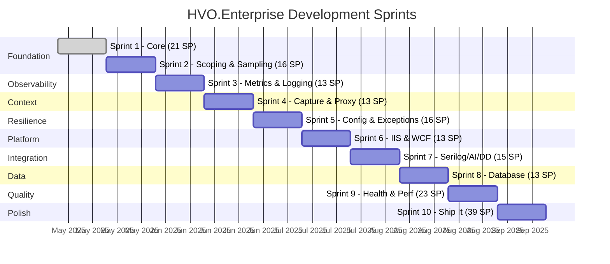

# HVO.Enterprise Roadmap

> **Last updated:** July 2025
> **Total scope:** 30 user stories · 10 sprints · 180 story points

## Current Progress

**6 of 30 stories complete (34 / 180 SP — 19%)**

```
Overall █████░░░░░░░░░░░░░░░░░░░░░░░░░ 19%
```

### Completed

| Story | Title | SP | Sprint | Status |
|-------|-------|---:|--------|--------|
| US-001 | Core Package Setup | 3 | 1 | ✅ Done |
| US-002 | Auto-Managed Correlation | 5 | 1 | ✅ Done |
| US-003 | Background Job Correlation | 5 | 1 | ✅ Done |
| US-004 | Bounded Queue Worker | 8 | 1 | ✅ Done |
| US-019 | HVO.Common Library | 5 | — | ✅ Done |
| US-029 | Documentation | 8 | 10 | ✅ Done |

### In Progress / Not Started

| Story | Title | SP | Sprint | Status |
|-------|-------|---:|--------|--------|
| US-005 | Operation Scoping with Detail Levels | 8 | 2 | 🔲 Not started |
| US-006 | Sampling Strategies | 8 | 2 | 🔲 Not started |
| US-007 | Runtime-Adaptive Metrics | 8 | 3 | 🔲 Not started |
| US-008 | ILogger Enrichment | 5 | 3 | 🔲 Not started |
| US-009 | Context Capture | 5 | 4 | 🔲 Not started |
| US-010 | DispatchProxy Instrumentation | 8 | 4 | 🔲 Not started |
| US-011 | Configuration Hot Reload | 8 | 5 | 🔲 Not started |
| US-012 | Exception Tracking & Aggregation | 8 | 5 | 🔲 Not started |
| US-013 | IIS Extension | 5 | 6 | 🔲 Not started |
| US-014 | WCF Extension | 8 | 6 | 🔲 Not started |
| US-015 | Serilog Extension | 5 | 7 | 🔲 Not started |
| US-016 | App Insights Extension | 5 | 7 | 🔲 Not started |
| US-017 | Datadog Extension | 5 | 7 | 🔲 Not started |
| US-018 | Database Extensions | 13 | 8 | 🔲 Not started |
| US-020 | Health Checks | 5 | 9 | 🔲 Not started |
| US-021 | Performance Benchmarks | 5 | 9 | 🔲 Not started |
| US-022 | HTTP Instrumentation | 5 | 9 | 🔲 Not started |
| US-023 | Lifecycle Management | 5 | 9 | 🔲 Not started |
| US-024 | Telemetry Statistics | 3 | 9 | 🔲 Not started |
| US-025 | End-to-End Integration Tests | 8 | 10 | 🔲 Not started |
| US-026 | Sample Applications | 8 | 10 | 🔲 Not started |
| US-027 | CI/CD Pipeline | 5 | 10 | 🔲 Not started |
| US-028 | NuGet Packaging | 5 | 10 | 🔲 Not started |
| US-029 | Documentation | 8 | 10 | ✅ Done |
| US-030 | Security & Compliance | 5 | 10 | 🔲 Not started |

## Sprint Timeline



## Planned Features by Sprint

### Sprint 2 — Foundation (16 SP)

- **US-005: Operation Scoping with Detail Levels** — Hierarchical scopes with configurable verbosity (`Minimal`, `Normal`, `Detailed`, `Diagnostic`). Controls how much telemetry is emitted per operation.
- **US-006: Sampling Strategies** — Pluggable sampling (fixed-rate, adaptive, priority-based) to control telemetry volume without losing critical traces.

### Sprint 3 — Observability (13 SP)

- **US-007: Runtime-Adaptive Metrics** — Metrics collection using `System.Diagnostics.Metrics` on .NET 8+ with graceful fallback on .NET Standard 2.0.
- **US-008: ILogger Enrichment** — Automatic enrichment of `ILogger` scopes with correlation IDs, operation context, and custom properties.

### Sprint 4 — Context (13 SP)

- **US-009: Context Capture** — Snapshot and restore ambient context (correlation, baggage, custom state) across async boundaries.
- **US-010: DispatchProxy Instrumentation** — Automatic method-level telemetry via `DispatchProxy` without manual instrumentation code.

### Sprint 5 — Resilience (16 SP)

- **US-011: Configuration Hot Reload** — Change telemetry settings (sampling rates, detail levels, enabled exporters) at runtime without restart.
- **US-012: Exception Tracking & Aggregation** — Deduplicate, classify, and rate-limit exception telemetry to reduce noise.

### Sprint 6 — Platform Extensions (13 SP)

- **US-013: IIS Extension** — `HttpModule`-based instrumentation for classic ASP.NET on IIS.
- **US-014: WCF Extension** — `IDispatchMessageInspector` / `IClientMessageInspector` for WCF service and client tracing.

### Sprint 7 — Integration Extensions (15 SP)

- **US-015: Serilog Extension** — Serilog sink and enricher that bridges structured logs into the telemetry pipeline.
- **US-016: App Insights Extension** — Export traces, metrics, and logs to Azure Application Insights.
- **US-017: Datadog Extension** — Export traces, metrics, and logs to Datadog APM.

### Sprint 8 — Data Extensions (13 SP)

- **US-018: Database Extensions** — Instrumented wrappers for EF Core, ADO.NET, Redis, and RabbitMQ with automatic command-level tracing.

### Sprint 9 — Quality (23 SP)

- **US-020: Health Checks** — `IHealthCheck` implementations for telemetry subsystem readiness (queue depth, exporter connectivity).
- **US-021: Performance Benchmarks** — BenchmarkDotNet suite covering hot paths (correlation lookup, metric recording, log enrichment).
- **US-022: HTTP Instrumentation** — `DelegatingHandler` for outbound HTTP calls with automatic header propagation.
- **US-023: Lifecycle Management** — Graceful startup/shutdown with queue drain, flush timeouts, and `IHostedService` integration.
- **US-024: Telemetry Statistics** — Internal counters (items queued, dropped, exported, errors) exposed via metrics and health checks.

### Sprint 10 — Polish (39 SP)

- **US-025: End-to-End Integration Tests** — Multi-service test scenarios validating correlation propagation across process boundaries.
- **US-026: Sample Applications** — Reference implementations for ASP.NET Core, WCF, Console, and Worker Service hosts.
- **US-027: CI/CD Pipeline** — GitHub Actions workflows for build, test, pack, and publish.
- **US-028: NuGet Packaging** — Package metadata, symbols, source link, and automated version management.
- **US-029: Documentation** — API docs, architecture guides, migration guides, and getting-started tutorials.
- **US-030: Security & Compliance** — PII scrubbing, data classification, audit logging, and GDPR considerations.

## Package Release Status

| Package | NuGet ID | Current | Target | Stories |
|---------|----------|---------|--------|---------|
| HVO.Common | `HVO.Common` | 0.1.0-alpha | 1.0.0 | US-019 |
| Core Telemetry | `HVO.Enterprise.Telemetry` | 0.1.0-alpha | 1.0.0 | US-001–012, US-020–024 |
| IIS Extension | `HVO.Enterprise.Telemetry.IIS` | — | 1.0.0 | US-013 |
| WCF Extension | `HVO.Enterprise.Telemetry.Wcf` | — | 1.0.0 | US-014 |
| Serilog Extension | `HVO.Enterprise.Telemetry.Serilog` | — | 1.0.0 | US-015 |
| App Insights Extension | `HVO.Enterprise.Telemetry.AppInsights` | — | 1.0.0 | US-016 |
| Datadog Extension | `HVO.Enterprise.Telemetry.Datadog` | — | 1.0.0 | US-017 |
| Data (shared) | `HVO.Enterprise.Telemetry.Data` | — | 1.0.0 | US-018 |
| EF Core Provider | `HVO.Enterprise.Telemetry.Data.EfCore` | — | 1.0.0 | US-018 |
| ADO.NET Provider | `HVO.Enterprise.Telemetry.Data.AdoNet` | — | 1.0.0 | US-018 |
| Redis Provider | `HVO.Enterprise.Telemetry.Data.Redis` | — | 1.0.0 | US-018 |
| RabbitMQ Provider | `HVO.Enterprise.Telemetry.Data.RabbitMQ` | — | 1.0.0 | US-018 |

## Version Compatibility Matrix

| Target Framework | HVO.Common | Core Telemetry | IIS | WCF | Serilog | AppInsights | Datadog | Data.* |
|-----------------|:----------:|:--------------:|:---:|:---:|:-------:|:-----------:|:-------:|:------:|
| .NET 10 | ✅ | ✅ | — | — | ✅ | ✅ | ✅ | ✅ |
| .NET 8 | ✅ | ✅ | — | — | ✅ | ✅ | ✅ | ✅ |
| .NET Standard 2.0 | ✅ | ✅ | — | — | ✅ | ✅ | ✅ | ✅ |
| .NET Framework 4.8.1 | ✅ | ✅ | ✅ | ✅ | ✅ | ✅ | ✅ | ✅ |

- **HVO.Common** and **Core Telemetry** target .NET Standard 2.0 for broad compatibility, with runtime-adaptive features on .NET 8+.
- **IIS** and **WCF** extensions target .NET Standard 2.0 (compatible with .NET Framework 4.8.1 and modern .NET versions that support .NET Standard 2.0).
- **Data.\*** packages target .NET Standard 2.0 with optional .NET 8+ optimizations.

## Breaking Change Policy

All packages follow [Semantic Versioning 2.0](https://semver.org/):

- **Pre-release (`0.x`)** — Breaking changes may occur between any minor version. Pin to exact versions.
- **Stable (`1.0+`)** — Breaking changes only in major versions. Minor and patch releases are backwards-compatible.
- **Public API surface** — Any type or member in a non-`internal` namespace is considered public API. Changes require a major version bump after 1.0.
- **Behavioral changes** — Significant behavioral changes (e.g., default sampling rate) are treated as breaking unless the previous behavior was clearly a bug.
- **Binary compatibility** — Maintained within a major version. Assembly binding redirects are not required for patch upgrades.

### Migration Support

When breaking changes are introduced in a major release:

1. A migration guide is published in `docs/migration/`.
2. The previous major version receives critical bug fixes for 6 months after the new major release.
3. Obsolete APIs are preserved for at least one major version with `[Obsolete]` warnings before removal.

## Deprecation Schedule

| Item | Deprecated In | Removed In | Replacement |
|------|:------------:|:----------:|-------------|
| *No deprecations yet* | — | — | — |

Deprecation notices will be added here as the API stabilizes. The general policy:

1. **Mark** — Add `[Obsolete("Use X instead. Will be removed in vN.")]` with a compiler warning.
2. **Warn** — Keep the deprecated API functional for at least one full major release cycle.
3. **Remove** — Delete the deprecated API in the next major version after the warning period.

## Further Reading

- [User Stories](./user-stories/) — Detailed acceptance criteria for each story
- [Architecture](./ARCHITECTURE.md) — System design and component diagrams
- [README](../README.md) — Getting started and quick overview
