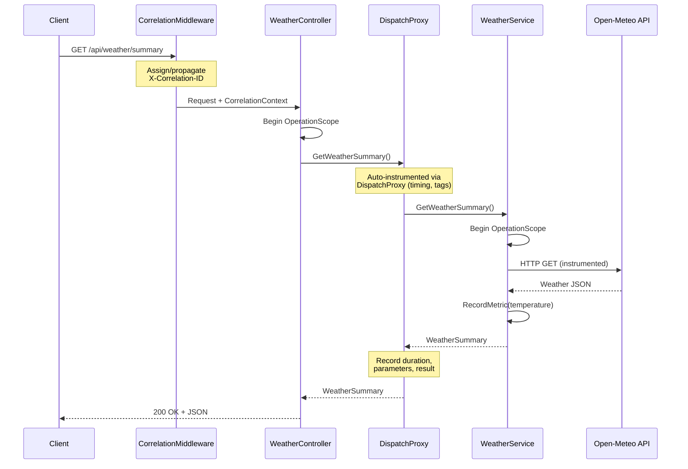

# HVO.Enterprise.Telemetry — .NET 8 Sample Application

A real-time **Weather Monitoring API** that demonstrates comprehensive usage of the [HVO.Enterprise.Telemetry](../../src/HVO.Enterprise.Telemetry/) library. The application fetches weather data from the free [Open-Meteo](https://open-meteo.com/) API, monitors multiple locations, evaluates alerts, and reports telemetry statistics — all while exercising every major feature of the telemetry library.

> **No API keys required.** Open-Meteo is a free, open-source weather API.

---

## Quick Start

```bash
# From the repository root
cd samples/HVO.Enterprise.Samples.Net8
dotnet run

# Or from the root with project path
dotnet run --project samples/HVO.Enterprise.Samples.Net8
```

Browse to **http://localhost:5133** to see the Swagger UI.

---

## Telemetry Features Demonstrated

| Feature | Where It's Used | Description |
|---|---|---|
| **Operation Scopes** | `WeatherService`, `WeatherController` | `IOperationScopeFactory.Begin()` with tags, lazy properties, results |
| **Correlation Context** | `CorrelationMiddleware` | `CorrelationContext.BeginScope()` with X-Correlation-ID HTTP header propagation |
| **Background Job Context** | `WeatherCollectorService` | `BackgroundJobContext.Capture()` / `Restore()` for correlation across background work |
| **DispatchProxy Instrumentation** | `IWeatherService` registration | `AddInstrumentedScoped<>()` wraps all service calls with automatic telemetry |
| **Exception Tracking** | `WeatherService`, error-demo endpoint | `ExceptionAggregator`, `TrackException()`, `scope.RecordException()` |
| **Telemetry Statistics** | `/api/weather/diagnostics`, `TelemetryReporterService` | `ITelemetryStatistics.GetSnapshot()` for live observability |
| **Health Checks** | `/health`, `/health/ready`, `/health/live` | `AddTelemetryHealthCheck()` monitors queue depth and error rates |
| **HTTP Instrumentation** | `WeatherService` → Open-Meteo calls | `TelemetryHttpMessageHandler` instruments outbound HTTP |
| **ILogger Enrichment** | All log output | `AddTelemetryLoggingEnrichment()` adds CorrelationId, TraceId, SpanId |
| **Multi-Level Configuration** | `ServiceConfiguration.ConfigureMultiLevelTelemetry()` | Global → Namespace → Type → Method hierarchy |
| **Parameter Capture** | Proxy-instrumented `IWeatherService` | `InstrumentationOptions` controls depth, PII detection |
| **Metric Recording** | `WeatherService`, `WeatherCollectorService` | `RecordMetric()` for weather temperatures, fetch durations, etc. |
| **Structured Logging** | Everywhere | Named parameters: `"{LocationName}"`, `"{Temperature}"`, etc. |
| **Lifecycle Management** | Auto-registered via `AddTelemetry()` | `TelemetryHostedService` for graceful startup/shutdown |

---

## API Endpoints

### Weather Endpoints

| Method | Route | Description |
|---|---|---|
| `GET` | `/api/weather/summary` | Weather summary for all monitored locations |
| `GET` | `/api/weather/{locationName}` | Current weather for a specific location |
| `GET` | `/api/weather/locations` | List all monitored locations |
| `POST` | `/api/weather/locations` | Add a new monitored location (JSON body with `name`, `latitude`, `longitude`) |
| `DELETE` | `/api/weather/locations/{name}` | Remove a monitored location |
| `GET` | `/api/weather/alerts` | Current weather alerts across all locations |
| `GET` | `/api/weather/diagnostics` | Live telemetry statistics (activities, errors, queue depth, throughput) |
| `GET` | `/api/weather/error-demo` | Deliberately triggers an exception to demonstrate error tracking |

### Diagnostic Endpoints

| Method | Route | Description |
|---|---|---|
| `GET` | `/ping` | Simple liveness check (returns correlation ID) |
| `GET` | `/info` | Application info (version, runtime, telemetry status) |
| `GET` | `/health` | Full health check with detailed JSON |
| `GET` | `/health/ready` | Readiness check (external dependency health) |
| `GET` | `/health/live` | Liveness check (confirms app is running) |

---

## Configuration

### Telemetry Options (`appsettings.json`)

All telemetry is configured in the `"Telemetry"` section:

```jsonc
{
  "Telemetry": {
    "ServiceName": "HVO.Samples.Net8.WeatherMonitor",
    "ServiceVersion": "1.0.0",
    "Environment": "Development",
    "Enabled": true,
    "DefaultSamplingRate": 1.0,          // 0.0 = off, 1.0 = sample everything

    "Sampling": {                         // Per-activity-source sampling
      "WeatherService": { "Rate": 1.0, "AlwaysSampleErrors": true }
    },

    "Queue": {                            // Bounded telemetry processing queue
      "Capacity": 10000,
      "BatchSize": 100
    },

    "Features": {                         // Toggle individual features
      "EnableHttpInstrumentation": true,
      "EnableProxyInstrumentation": true,
      "EnableExceptionTracking": true,
      "EnableParameterCapture": true
    },

    "Metrics": {                          // Runtime-adaptive metrics
      "Enabled": true,
      "CollectionIntervalSeconds": 10
    },

    "ActivitySources": [
      "HVO.Enterprise.Telemetry",
      "HVO.Samples.Weather"
    ],

    "ResourceAttributes": {               // Custom tags on all telemetry
      "deployment.region": "local",
      "team.name": "HVO.Enterprise"
    }
  }
}
```

### Multi-Level Configuration (Code)

The sample also demonstrates programmatic multi-level configuration in [`Configuration/ServiceConfiguration.cs`](Configuration/ServiceConfiguration.cs):

```csharp
var configurator = new TelemetryConfigurator();

// Global defaults
configurator.Global()
    .SamplingRate(1.0)
    .CaptureParameters(ParameterCaptureMode.NamesOnly)
    .RecordExceptions(true)
    .Apply();

// Namespace-level override
configurator.Namespace("HVO.Enterprise.Samples.Net8.BackgroundServices")
    .SamplingRate(0.5)
    .Apply();

// Type-level override
configurator.ForType<WeatherService>()
    .CaptureParameters(ParameterCaptureMode.NamesAndValues)
    .Apply();
```

---

## Disabled Service Integrations

The following services are configured but **disabled by default**. Each shows the correct setup pattern so you can enable them when the infrastructure is available. See [`Configuration/ServiceConfiguration.cs`](Configuration/ServiceConfiguration.cs) for the full commented-out DI registration code, and [`appsettings.json`](appsettings.json) for the corresponding configuration sections.

| Service | NuGet Package | Description |
|---|---|---|
| **Application Insights** | `HVO.Enterprise.Telemetry.AppInsights` | Bridge telemetry to Azure Application Insights |
| **Datadog** | `HVO.Enterprise.Telemetry.Datadog` | Export traces and metrics to Datadog |
| **Serilog** | `HVO.Enterprise.Telemetry.Serilog` | Enrich Serilog with HVO correlation context |
| **IIS** | `HVO.Enterprise.Telemetry.Iis` | Instrument IIS modules and handlers (ASP.NET non-Core) |
| **WCF** | `HVO.Enterprise.Telemetry.Wcf` | Message inspectors and operation behaviors |
| **Database (EF Core)** | `HVO.Enterprise.Telemetry.Data.EfCore` | DB command interceptor with slow query detection |
| **Database (ADO.NET)** | `HVO.Enterprise.Telemetry.Data.AdoNet` | Raw ADO.NET instrumentation |
| **Redis** | `HVO.Enterprise.Telemetry.Data.Redis` | StackExchange.Redis command instrumentation |
| **RabbitMQ** | `HVO.Enterprise.Telemetry.Data.RabbitMQ` | Message publish/consume instrumentation |

---

## Architecture

```
Program.cs                           ← Entry point, middleware pipeline
├── CorrelationMiddleware            ← Assigns/propagates X-Correlation-ID
├── WeatherController                ← 8 REST endpoints with telemetry
├── IWeatherService                  ← Interface (proxied by DispatchProxy)
│   └── WeatherService               ← Real implementation
│       └── Open-Meteo HTTP Client   ← Instrumented outbound calls
├── WeatherCollectorService          ← BackgroundService (5-min collection)
├── TelemetryReporterService         ← IHostedService (1-min stats report)
├── WeatherApiHealthCheck            ← IHealthCheck for Open-Meteo API
└── ServiceConfiguration             ← Full DI wiring + disabled services
```

---

## Example Usage

### Fetch Weather Summary
```bash
curl http://localhost:5133/api/weather/summary
```

### Add a Location
```bash
curl -X POST http://localhost:5133/api/weather/locations \
  -H "Content-Type: application/json" \
  -d '{"name":"Paris","latitude":48.8566,"longitude":2.3522}'
```

### Check Telemetry Diagnostics
```bash
curl http://localhost:5133/api/weather/diagnostics
```

### Trigger Error Demo
```bash
curl http://localhost:5133/api/weather/error-demo
```

### Health Check
```bash
curl http://localhost:5133/health
```

### With Correlation ID
```bash
curl -H "X-Correlation-ID: my-trace-123" http://localhost:5133/api/weather/summary
```

---

## Background Services

### Weather Collector (`WeatherCollectorService`)
- Runs every **5 minutes** (10-second initial delay)
- Fetches weather for all monitored locations in parallel
- Creates a correlation scope per collection cycle
- Uses `BackgroundJobContext.Capture()` for context propagation
- Records metrics: fetch duration, temperatures, success/failure counts

### Telemetry Reporter (`TelemetryReporterService`)
- Runs every **1 minute** (30-second initial delay)
- Logs a formatted report of all telemetry statistics
- Shows: activities created/completed, exceptions, metrics, queue depth, error rate, throughput, uptime

---

## Project Structure

```
HVO.Enterprise.Samples.Net8/
├── Program.cs                          ← App bootstrap + middleware pipeline
├── appsettings.json                    ← Full telemetry configuration
├── appsettings.Development.json        ← Dev overrides
├── Properties/launchSettings.json      ← HTTP/HTTPS launch profiles
├── Configuration/
│   └── ServiceConfiguration.cs         ← DI registration + disabled services
├── Controllers/
│   └── WeatherController.cs            ← REST API (8 endpoints)
├── Services/
│   ├── IWeatherService.cs              ← Service interface
│   └── WeatherService.cs               ← Implementation with telemetry
├── BackgroundServices/
│   ├── WeatherCollectorService.cs      ← Periodic weather collection
│   └── TelemetryReporterService.cs     ← Periodic stats reporting
├── Middleware/
│   └── CorrelationMiddleware.cs        ← X-Correlation-ID middleware
├── HealthChecks/
│   └── WeatherApiHealthCheck.cs        ← Open-Meteo API health check
└── Models/
    └── WeatherModels.cs                ← DTOs + domain models
```

---

## Example Output

### Console Startup Logs

When the application starts, you'll see telemetry initialization and background service registration:

```
info: HVO.Enterprise.Telemetry[0]
      Telemetry initialized: ServiceName=HVO.Samples.Net8.WeatherMonitor, Environment=Development
info: HVO.Enterprise.Telemetry[0]
      Activity sources registered: HVO.Enterprise.Telemetry, HVO.Samples.Weather
info: HVO.Enterprise.Telemetry[0]
      Telemetry background worker started (queue capacity: 10000, batch size: 100)
info: Microsoft.Hosting.Lifetime[14]
      Now listening on: http://localhost:5133
info: Microsoft.Hosting.Lifetime[0]
      Application started. Press Ctrl+C to shut down.
```

### Weather Summary Response (`GET /api/weather/summary`)

```json
{
  "timestamp": "2026-02-11T06:00:00Z",
  "locations": [
    {
      "name": "New York",
      "latitude": 40.7128,
      "longitude": -74.006,
      "temperature": 2.5,
      "windSpeed": 15.3,
      "humidity": 65,
      "conditions": "Partly Cloudy",
      "lastUpdated": "2026-02-11T05:55:00Z"
    },
    {
      "name": "London",
      "latitude": 51.5074,
      "longitude": -0.1278,
      "temperature": 8.1,
      "windSpeed": 22.7,
      "humidity": 80,
      "conditions": "Overcast",
      "lastUpdated": "2026-02-11T05:55:00Z"
    }
  ],
  "correlationId": "a1b2c3d4-e5f6-7890-abcd-ef1234567890"
}
```

### Diagnostics Response (`GET /api/weather/diagnostics`)

```json
{
  "telemetry": {
    "activitiesCreated": 142,
    "activitiesCompleted": 140,
    "exceptionsTracked": 2,
    "metricsRecorded": 87,
    "queueDepth": 3,
    "queueCapacity": 10000,
    "errorRate": 0.014,
    "throughputPerSecond": 2.4,
    "uptime": "00:15:32"
  },
  "correlationId": "d4e5f6a7-b8c9-0123-4567-890abcdef012"
}
```

### Health Check Response (`GET /health`)

```json
{
  "status": "Healthy",
  "totalDuration": "00:00:00.0234567",
  "entries": {
    "telemetry": {
      "status": "Healthy",
      "description": "Queue depth: 3/10000, Error rate: 1.4%",
      "duration": "00:00:00.0001234"
    },
    "weather-api": {
      "status": "Healthy",
      "description": "Open-Meteo API responding",
      "duration": "00:00:00.0230000"
    }
  }
}
```

### Enriched Log Output (with ILogger enrichment)

Each log line includes telemetry context automatically:

```
info: WeatherService[0]
      => CorrelationId:a1b2c3d4 TraceId:0af7651916cd43dd8448eb211c80319c SpanId:b7ad6b7169203331
      Fetched weather for "New York": 2.5°C, Partly Cloudy
info: WeatherService[0]
      => CorrelationId:a1b2c3d4 TraceId:0af7651916cd43dd8448eb211c80319c SpanId:00f067aa0ba902b7
      Fetched weather for "London": 8.1°C, Overcast
```

### Background Service Telemetry Report

The `TelemetryReporterService` logs a formatted report every minute:

```
info: TelemetryReporterService[0]
      ┌─────────────────────────────────────────┐
      │        Telemetry Statistics Report       │
      ├─────────────────────────────────────────┤
      │ Activities Created:          142        │
      │ Activities Completed:        140        │
      │ Exceptions Tracked:            2        │
      │ Metrics Recorded:             87        │
      │ Queue Depth:                3/10000     │
      │ Error Rate:                  1.4%       │
      │ Throughput:              2.4 ops/sec    │
      │ Uptime:                   00:15:32     │
      └─────────────────────────────────────────┘
```

### Error Demo Response (`GET /api/weather/error-demo`)

```json
{
  "error": "Intentional error for demonstration",
  "correlationId": "f1e2d3c4-b5a6-7890-fedc-ba0987654321",
  "exceptionFingerprint": "WeatherService.DemoError:InvalidOperationException",
  "tracked": true
}
```

---

## Request Flow



---

## Related Documentation

- [Architecture](../../docs/ARCHITECTURE.md) — System design, component diagrams, threading model
- [Platform Differences](../../docs/DIFFERENCES.md) — .NET Framework vs .NET 8+ comparison
- [Migration Guide](../../docs/MIGRATION.md) — Migrating from other telemetry libraries
- [Core Telemetry](../../src/HVO.Enterprise.Telemetry/README.md) — Core library API reference
